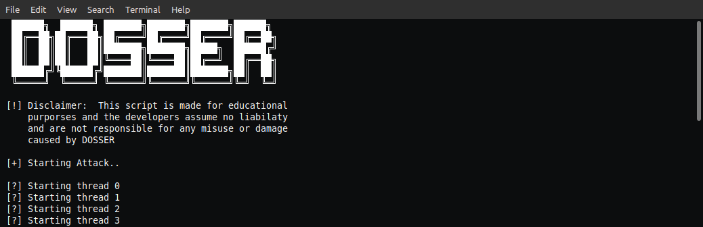

<p align="center">


</p>

# Denail of Service script written in python
<p align="center">

</p>

## Usage
Download and run `main.py` using the following command:
```
python3.8 main.py <target> <threads> <time>
```
in linux and on windows
```
py -3 main.py <target> <threads> <time>
```
